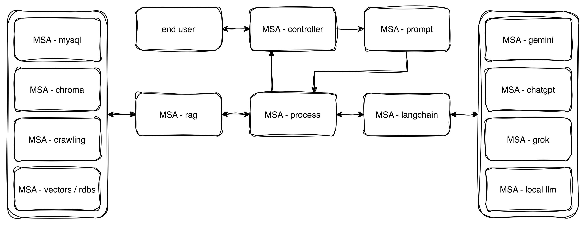

# InsightBot (인사이트 봇)

	

**InsightBot**은 다양한 MSA(Microservice Architecture) 기반 서비스들을 통합·확장하는 AI/데이터/자동화 플랫폼입니다.  
각 서비스는 독립적으로 동작하며, insightbot.flow.png의 구조를 기준으로 유기적으로 연결됩니다.

## 주요 특징
- MSA 구조 기반의 유연한 서비스 확장
- 각 서비스(예: Gemini, VectorDB, Prompt, MySQL 등) 독립 실행 및 통합
- API, 데이터 파이프라인, 벡터 검색, LLM 연동 등 다양한 기능
- insightbot.flow.png로 전체 서비스 흐름 한눈에 파악

## 확장 및 커스터마이징
- 새로운 MSA 서비스 추가 시 insightbot.flow.png에 반영
- 각 서비스별 환경설정(config.json 등)으로 유연한 구조 지원
- API/DB/벡터/LLM 등 다양한 기술 스택과 연동 가능

## 서비스별 Repositories
- Controller - https://github.com/urobonos/msa_controller
- Prompt - https://github.com/urobonos/msa_prompt
- Process - https://github.com/urobonos/msa_process
- RAG - https://github.com/urobonos/msa_process
    - Chroma - https://github.com/urobonos/msa_vectordb
    - Mysql - https://github.com/urobonos/msa_mysql
- LangChain - https://github.com/urobonos/msa_langchain
    - Gemini - https://github.com/urobonos/msa_gemini
